# convolutions

## Background

This repository compares ordinary convolution of smooth functions on the 2-torus with the spectral graph convolution defined in _Bruna, Joan, et al. "Spectral networks and locally connected networks on graphs"_ (https://arxiv.org/abs/1312.6203).

Define the 2-torus  to be the unit square 2-torus  with opposing sides identified, i.e. the unit square with the property that one reappears on the other side if one leaves the square on one side.
Let  be functions on .
The ordinary convolution of  is defined to be:


Let  be an evenly spaced grid on  with  vertices, denote the vertex set by .
For any function  on  denote by  its restriction to the vertices of the graph.
I.e.,  can be seen as a matrix of size  with real entries.
Let  be an orthonormal basis of eigenvectors of the graph Laplacian of  (this basis has  elements).
The spectral graph convolution of  is then defined to be:


Here,  denotes the -inner product on .

We answer the question to what extent to following approximate equality holds:
.
That is:
to what extent do convolution and restricting a function to  commute?

## Answer

We observe that the two convolutions are close to agreeing if one chooses the eigenbasis  to mimic the eigenbasis of the smooth Laplacian on the circle.
To be precise, basis elements are given by restricting the functions 
 to the vertices of the graph.
Using this basis, we apply smooth convolution and graph convolution in some test cases and observe that the two approximately agree.
Note that the very non-smooth sixth example gives different results.

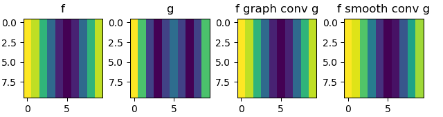
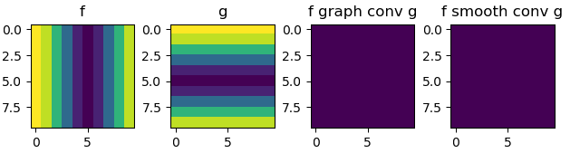
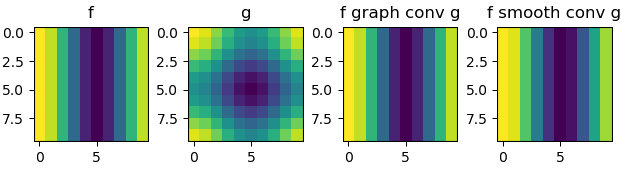

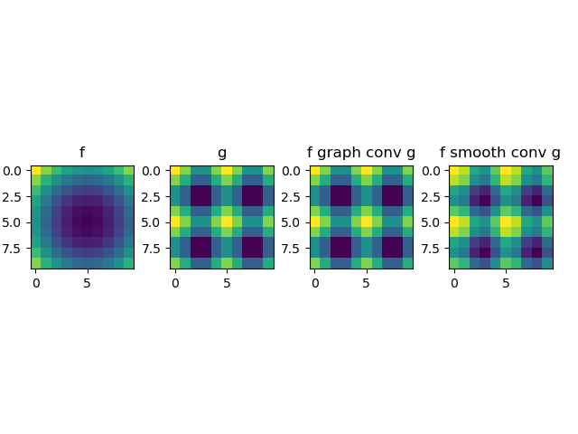
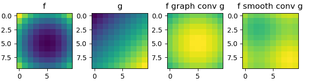

If choosing the eigenbasis computed by scipy, we find that the two convolutions do not agree:

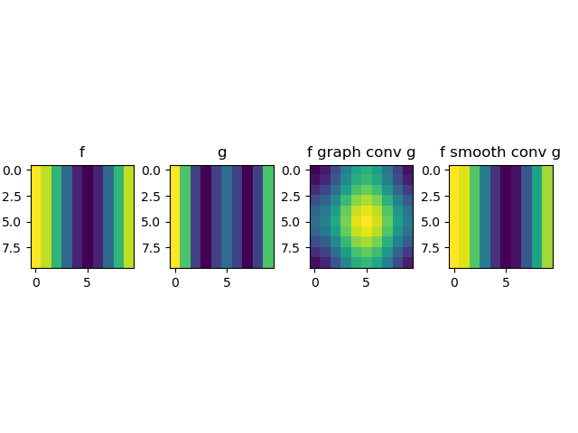
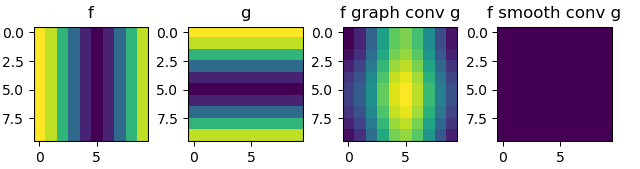
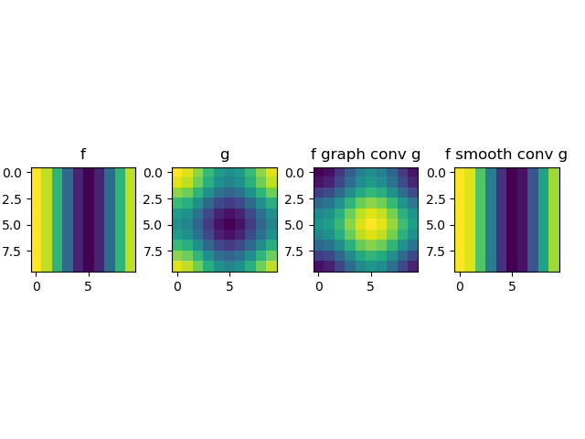
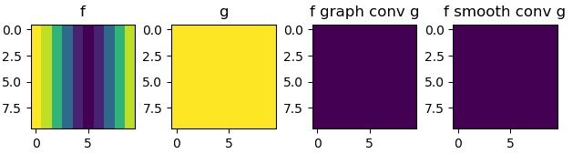
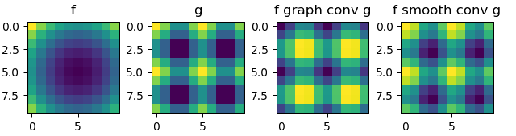
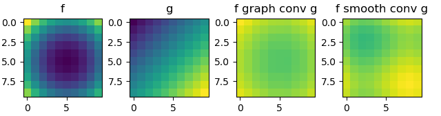

## Reproducing the experiment

Run ```graph_laplacian/commuting_operations_experiments.py``` and change line 55 ```path1_conv = path1(f, g, n, 'fourier_series')``` back and forth from ```'fourier_series'``` to ```'scipy'``` to observe the effect of choosing different eigenbases.
